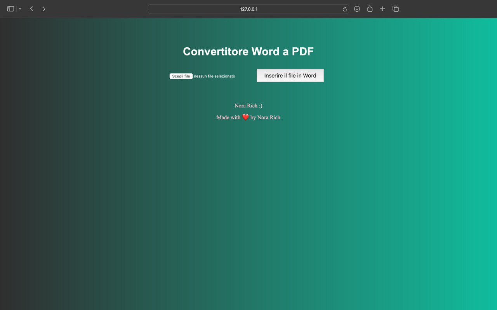

# Word to PDF Converter Web App

Questa è una semplice web app sviluppata in Python utilizzando Flask, che consente agli utenti di convertire file in formato Word (.docx) in PDF. L'interfaccia utente è progettata per essere intuitiva e accessibile, permettendo il caricamento e la conversione dei file con pochi clic.

## Anteprima della Web App
 

## Caratteristiche principali
- **Interfaccia intuitiva**: Gli utenti possono facilmente caricare i loro file Word e avviare la conversione.
- **Conversione rapida**: La web app utilizza librerie Python per garantire una conversione veloce e di alta qualità.
- **Download diretto**: Dopo la conversione, gli utenti possono scaricare il file PDF risultante con un semplice clic.
- **Design moderno**: L'app ha un design semplice e moderno, con sfondi sfumati e un messaggio personalizzato.

## Tecnologie utilizzate
- **Python**
- **Flask**: Per il backend e la gestione delle richieste web.
- **pdfkit**: Per la conversione da HTML a PDF.
- **python-docx**: Per l'elaborazione dei file Word.

## Istruzioni per l'uso
1. Clona questo repository.
2. Installa le dipendenze richieste utilizzando `pip install -r requirements.txt`.
3. Assicurati di avere wkhtmltopdf installato e configurato nel tuo `PATH`.
4. Avvia l'app con il comando `python app.py`.
5. Visita `http://127.0.0.1:5000` nel tuo browser per utilizzare l'app.

## Contribuzioni
Se desideri contribuire a questo progetto, sentiti libero di aprire una pull request o segnalare problemi. Tutti i contributi sono benvenuti!

## Creato con ❤️ da Nora Rich
